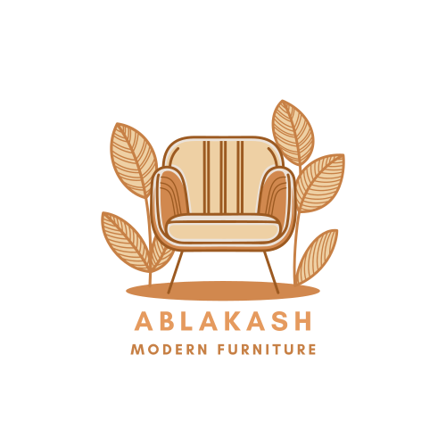
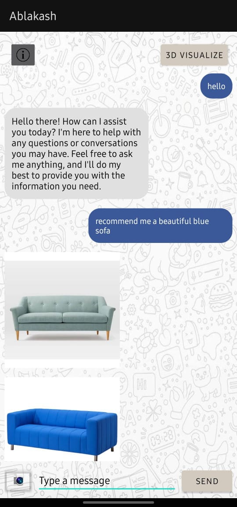

<a id="readme-top"></a>
<div align="center">

</div>

<!-- PROJECT LOGO -->
<div align="center">
  <a href="https://github.com/MrSa3dola/AR_RAG/blob/main/README.md">
    
  </a>
  <p align="center">
    <a href="https://drive.google.com/file/d/1uHvKp35EkJaHpnmUyHCeTQzPx6RouVmV/view?usp=drive_link">View Demo</a>
  </p>
</div>

<!-- TABLE OF CONTENTS -->
<details>
  <summary>Table of Contents</summary>
  <ol>
    <li>
      <a href="#about-the-project">About The Project</a>
      <ul>
        <li><a href="#built-with">Built With</a></li>
      </ul>
    </li>
    <li>
      <a href="#getting-started">Getting Started</a>
      <ul>
        <li><a href="#prerequisites">Prerequisites</a></li>
        <li><a href="#installation">Installation</a></li>
      </ul>
    </li>
    <li><a href="#roadmap">Roadmap</a></li>
    <li><a href="#contact">Contact</a></li>
  </ol>
</details>

<!-- ABOUT THE PROJECT -->
## About The Project
<div align="center">
  
</div>

This project is a chatbot for furniture recommendation using multi-agents. It integrates multiple AI technologies to provide an intelligent and interactive experience for users.

<p align="right">(<a href="#readme-top">back to top</a>)</p>

### Built With
[![FastAPI][FastAPI-badge]][FastAPI-url]
[![CrewAI][CrewAI-badge]][CrewAI-url]
[![Pinecone][Pinecone-badge]][Pinecone-url]
[![FAISS][FAISS-badge]][FAISS-url]
[![Florence-2-large][Florence-badge]][Florence-url]
[![TRELLIS][TRELLIS-badge]][TRELLIS-url]
[![Gemini LLM][Gemini-badge]][Gemini-url]
[![BLIP][BLIP-badge]][BLIP-url]
[![Kotlin][Kotlin-badge]][Kotlin-url]
[![Azure][Azure-badge]][Azure-url]

[FastAPI-badge]: https://img.shields.io/badge/FastAPI-009688?style=for-the-badge&logo=fastapi&logoColor=white
[FastAPI-url]: https://fastapi.tiangolo.com/

[CrewAI-badge]: https://img.shields.io/badge/CrewAI-6C757D?style=for-the-badge&logo=ai&logoColor=white
[CrewAI-url]: https://crewai.com/

[Pinecone-badge]: https://img.shields.io/badge/Pinecone-0080FF?style=for-the-badge&logo=pinecone&logoColor=white
[Pinecone-url]: https://www.pinecone.io/

[FAISS-badge]: https://img.shields.io/badge/FAISS-6600CC?style=for-the-badge&logo=facebook&logoColor=white
[FAISS-url]: https://faiss.ai/

[Florence-badge]: https://img.shields.io/badge/Florence--2--large-006699?style=for-the-badge&logo=microsoft&logoColor=white
[Florence-url]: https://huggingface.co/microsoft/florence-2-large

[TRELLIS-badge]: https://img.shields.io/badge/TRELLIS-00A65A?style=for-the-badge&logo=3d&logoColor=white
[TRELLIS-url]: https://huggingface.co/spaces/JeffreyXiang/TRELLIS

[Gemini-badge]: https://img.shields.io/badge/Gemini-4285F4?style=for-the-badge&logo=google&logoColor=white
[Gemini-url]: https://aistudio.google.com/

[BLIP-badge]: https://img.shields.io/badge/BLIP-4CAF50?style=for-the-badge&logo=ai&logoColor=white
[BLIP-url]: https://huggingface.co/Salesforce/blip

[Kotlin-badge]: https://img.shields.io/badge/Kotlin-0095D5?style=for-the-badge&logo=kotlin&logoColor=white
[Kotlin-url]: https://kotlinlang.org/

[Azure-badge]: https://img.shields.io/badge/Azure-0078D4?style=for-the-badge&logo=microsoftazure&logoColor=white
[Azure-url]: https://azure.microsoft.com/

<p align="right">(<a href="#readme-top">back to top</a>)</p>

## Getting Started

### Prerequisites
Ensure you have the following installed:
- Python 3.12
- FastAPI
- Uvicorn
- Pinecone client
- Kotlin (for mobile app development)

### Installation

1. Clone the repository:
   ```sh
   git clone https://github.com/MrSa3dola/AR_RAG.git
   cd AR_RAG
   ```

2. Create and activate a virtual environment:
   ```sh
   python -m venv venv
   source venv/bin/activate  # On Windows use `venv\Scripts\activate`
   ```

3. Install dependencies:
   ```sh
   pip install -r requirements.txt
   ```

4. Run the FastAPI backend:
   ```sh
   uvicorn main:app --host 0.0.0.0 --port 8000
   ```

<p align="right">(<a href="#readme-top">back to top</a>)</p>

## Roadmap
- [x] Scrape IKEA data
- [x] Implement image captioning with Florence-2-large
- [x] Convert images to 3D models with TRELLIS
- [x] Integrate embedding search using Pinecone
- [x] Develop AI agents with CrewAI
- [x] Deploy backend on Azure
- [x] Develop Kotlin mobile app
- [ ] Implement Vision RAG for image recommendations
- [ ] Improve chatbot responses with fine-tuned Gemini LLM
- [ ] Add multilingual support
  - [ ] Arabic
<p align="right">(<a href="#readme-top">back to top</a>)</p>

## Contact
* Saad Mohamed - [GitHub](https://github.com/MrSa3dola) - saad.2002.ms@gmail.com
* Yara Mohamed - [GitHub](https://github.com/yara-mohamed1942001) - yaramo656@gmail.com

[Project Link](https://github.com/MrSa3dola/AR_RAG)

<p align="right">(<a href="#readme-top">back to top</a>)</p>
